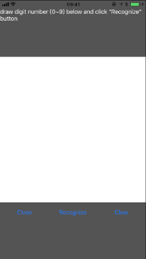
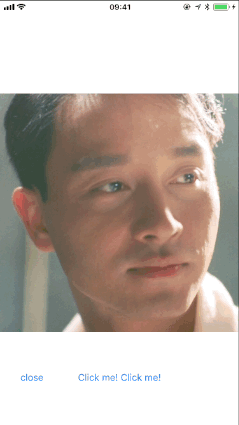
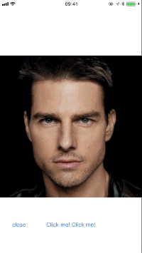

# Brouhaha: is a Deep Learning toolkitfor iOS

The Brouhaha is a Deep Learning toolkit that based on iOS Metal. It make easier to use the iOS GPU shader to run the Deep Learning algorithms.This toolkit is no only include the Metal shader, but also include abstract layer of Neural networks write in objective-c. 

China site:https://gitee.com/JingQiManHua/Brouhaha

## Update Note
### last
1. simplify the API and make it easier to use.
2. add a tempporary MTLBuffer to save the memory when runnning.

#### 2017
1. Add float32 support, The layers support the flaot16 and float32 at the same time.
2. Add a art-transform demo on float32.
3. change the API and it become more feasible.

## Introduction
The Brouhaha is only used to run the predicting of a Deep Learning algorithm, it can’t used to training a algorithm. Before using Brouhaha, you must have a pretrained model by other toolkit like: Caffe, Torch or Tensorflow.
The Brouhaha has common layers like:Convolution(include Transposed and Dilated convolution), Pooling, Active, FullConnect, BatchNormalize and some special layer for Image-convert. It includes 3 parts:
1. **BrouhahaMetal:** which is write by Metal shader, using the GPU to speed up the layer’s calculating.
2. **Brouhaha:** includes the abstract layers of Deep Learning, write by objective-c. For speed up, some functions coding in asm. Brouhaha must be based on the BrouhahaMetal.
3. **BrouhahaDemo:** includes 3 demos to show how to use this toolkit.The LeNet demo is a Convolution Neural Networks algorithm that use to recognize a digit number from a image . The ArtTransform Demo is a Convolution Neural Networks algorithm for “Artistic Style Transform” like Prisma. It includes 2 demo one is based on float16, another is float32.

## Demo
**Build:** Before build the BrouhahaDemo, must build the BrouhahaMetal first and copy the "BrouhahaMetal.metallib" file to BrouhahaDemo's bundle.
 
**LeNet:** This demo is a Neural Networks that recognize the digit number from images. The details of the algorithm ref: http://yann.lecun.com/exdb/lenet/. The model file is from internet, sorry forgot the source.
 

**ArtTransform:** This demo is a Convolution Neural Networks algorithm for “Artistic Style Transform” like Prisma. The algorithm details ref:https://arxiv.org/abs/1603.08155 and the model file is from: https://github.com/lengstrom/fast-style-transfer#video-stylization.It includes 2 demo one is based on float16, another is float32.
 

***Based on Float32*** 

 

***Based on Float16*** 

## Why Brouhaha?
1. Brouhaha use the GPU instead of CPU, so it has high-performance.
2. In Brouhaha every layer has 2 implements, one is float16 another is float32, it is easy to choose for the special purpose. Float16 for faster and Float32 fo precision.
3. Brouhaha includes a lot new layers like:TransposedConvolution or DilatedConvolution
4. Does not like the Apple's Core ML or other third toolkit based on Metal, Boruhaha don't needs iOS 10+. It just needs the iOS 8+.

## Future Work
1. Support RNN.
