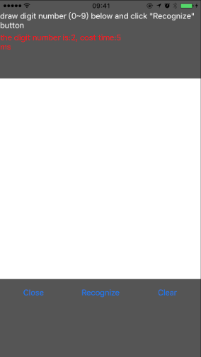

# Brouhaha: is a Deep Learning toolkit based on iOS Metal

The Brouhaha is a Deep Learning toolkit that based on iOS Metal. It make easier to use the iOS GPU shader to run the Deep Learning algorithms.This toolkit is no only include the Metal shader, but also include abstract layer of Neural networks write in objective-c. 
## China Site
https://gitee.com/JingQiManHua/Brouhaha

## Introduction
The Brouhaha is only used to run the predicting of a Deep Learning algorithm, it can’t used to training a algorithm. Before useing Brouhaha, you must have a pretrained model by other toolkit like: Caffe, Torch or Tensorflow.
The Brouhaha has common layers like:Convolution(include Transposed and Dilated convolution), Pooling, Active, FullConnect, BatchNormalize and some special layer for Image-convert. It includes 3 parts:
1. **BrouhahaMetal:** which is write by Metal shader, using the GPU to speed up the layer’s calculating.
2. **Brouhaha:** includes the abstract layers of Deep Learning, write by objective-c. For speed up, some functions coding in asm. Brouhaha must be based on the BrouhahaMetal.
3. **Brouhaha-Demo:** includes 2 demos to show how to use this toolkit.The LeNet demo is a Convolution Neural Networks algorithm that use to recognize a digit number from a image . The ArtTransform Demo is a Convolution Neural Networks algorithm for “Artistic Style Transform” like Prisma.
 
For speed, the toolkit will convert the float32 model to float16, so it may be lost precision. Brouhaha is still on developing, so the API is not stabled yet.

## Demo
**Build:** Before build the Brouhaha-Demo, must build the BrouhahaMetal first and copy the "BrouhahaMetal.metallib" file to Brouhaha-Demo's bundle.
 
**LeNet:** This demo is a Neural Networks that recognize the digit number from images. The details of the algorithm ref: http://yann.lecun.com/exdb/lenet/. The model file is from internet, sorry forgot the source.
 

**ArtTransform:** This demo is a Convolution Neural Networks algorithm for “Artistic Style Transform” like Prisma. The algorithm details ref:https://arxiv.org/abs/1603.08155 and the model file is from: https://github.com/lengstrom/fast-style-transfer#video-stylization.
 

## Why Brouhaha?
Brouhaha use the GPU instead of CPU, so it has high-performance. For speed up, using float16 instead of float32. It will be lost some precision but get fater. The only need by Brouhaha is Metal and the Metal has been supported from iOS 8, so does't needs any other library.  
Does not like the Apple's Core ML or other third toolkit based on Metal, Boruhaha don't needs iOS 10+. It just needs the iOS 8+, because Brouhaha has rewrited the Metal shader for every layers.

## Future Work
1. Support float32.
2. Support RNN.
