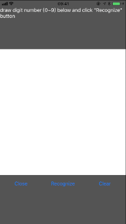

# Brouhaha:基于iOS Metal的深度学习运算库

Brouhah是一个基于iOS Metal的深度学习运算库。这个库可以方便的调用iOS Metal Shader执行深度学习算法。

## 地址
github:https://github.com/amazingyyc/Brouhaha
 
码云:https://gitee.com/JingQiManHua/Brouhaha

## 更新 
### 最新
1. 精简API，调用更方便。
2. 添加一个临时MTLBuffer的类，在运行期间更加节省内存。

### 2017
1. 添加Float32支持，现在所有的“层”均支持Float16和Float32。
2. 添加基于Float32的风格转换Demo。
3. 修改API，更灵活的使用。

## 介绍
Brouhaha只包含深度学习的前向运算，并不能用于训练一个深度学习模型。在使用Brouhaha之前必须有一个使用其他的训练库（比如：Caffe，Tensorflow，Torch）训练好的深度学习model。Brouhaha包含常用的卷积（包括转置卷积，Dilated卷积），池化，激活，全联接，BatchNormalize和方便图片转换的转换层。主要包括以下三个部分：
1. **BrouhahaMetal:** 使用Metal Shader编写的核心运算函数，用于加速计算。
2. **Brouhaha:** 包含常用的神经网络层的抽象，使用Objective-c开发，为了加速引入了一些汇编。
3. **BrouhahaDemo:** 包含3个Demo，演示怎么使用这个库。LeNet是一个使用卷积神经网络识别图片中的数字的模型。ArtTransform类似于Prisma，用于图片风格的转换，包含基于Float16和Float32的实现。

## Demo
**Build:** 在运行Brouhaha-Demo之前需要首先编译BrouhahaMetal，然后将生成的文件BrouhahaMetal.metallib拷贝到Brouhaha-Demo的bundle中。
 
**LeNet:** 这个Demo是使用神经网络识别图片中的数字。具体的算法参考：http://yann.lecun.com/exdb/lenet/。模型文件来源于网路，抱歉忘记了出处。
 

**ArtTransform:** 这个Demo使用卷积神经网络进行图片风格的转换。算法参考：https://arxiv.org/abs/1603.08155，模型文件来源于：https://github.com/lengstrom/fast-style-transfer#video-stylization。包含了两个实现一个基于Float32一个基于Float16。
 

***基于Float32*** 

 

***基于Float16*** 

## Brouhaha的优势
1. 使用GPU代替CPU速度更快。
2. 每个层均包含两种实现Float16和Float32，便于选择。Float16可以用于提速，Float32用于提高精度。
3. 包含最先的“层”实现比如:TransposedConvolution， DilatedConvolution
4. 不想Apple的Core ML和其他的第三方的库需要iOS10+的系统，Brouhaha只需要iOS8+。

## 未来工作
1. 支持RNN。